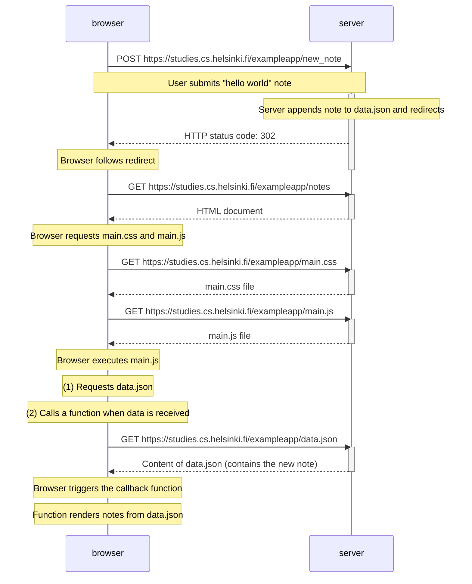

The user is currently viewing the webpage at "https://studies.cs.helsinki.fi/exampleapp/notes." On this page, the user performs the following actions:

1. Enters the text "hello world" into a text box.
2. Submits the form by clicking a "submit" button.

Here's a description of the interactions between the browser and the server that follow:

