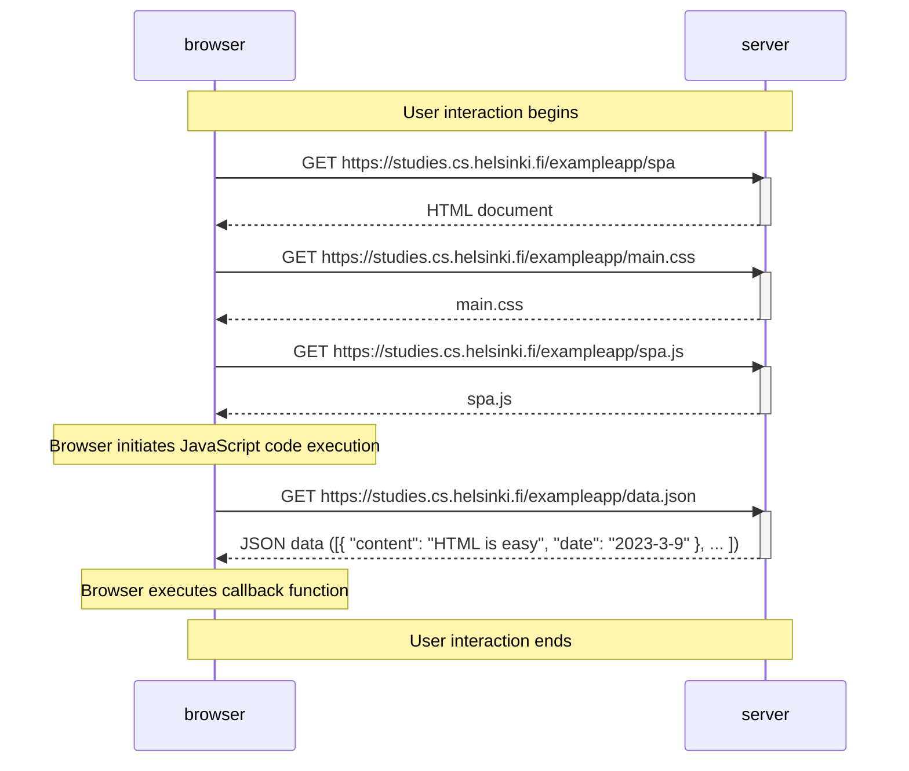

This diagram depicts the scenario where a user accesses the Single Page Application (SPA) version of the note-taking application hosted at https://studies.cs.helsinki.fi/exampleapp/spa. It showcases the sequence of interactions between the user's web browser and the server, highlighting the retrieval of essential resources and data to load and render the SPA.

