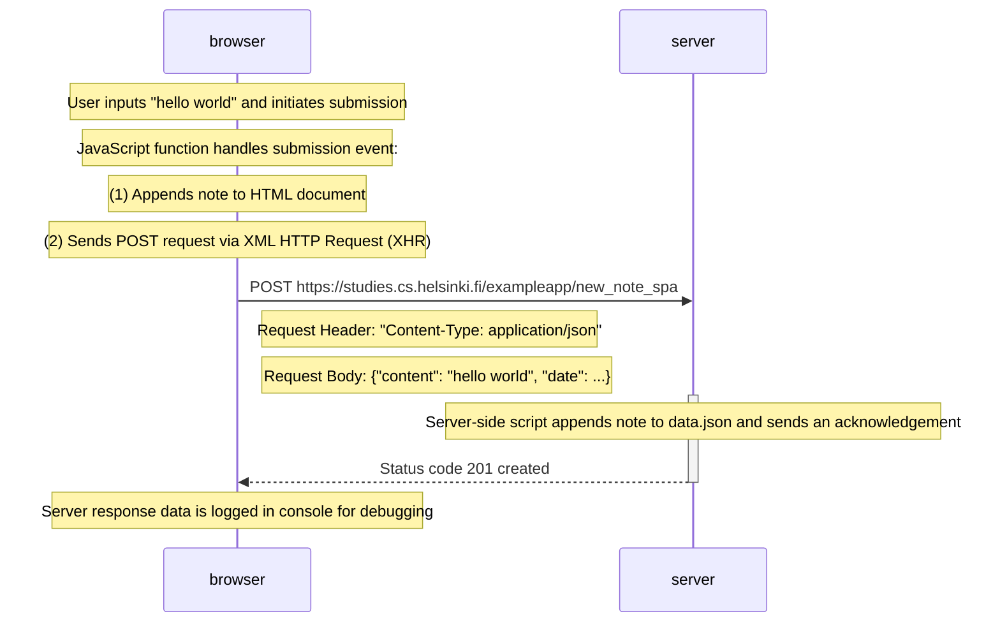

The diagram illustrates the user's interaction with a Single Page Application (SPA) located at https://studies.cs.helsinki.fi/exampleapp/spa.

```mermaid
sequenceDiagram
    participant browser
    participant server

    Note over browser: User inputs "hello world" and initiates submission
    Note over browser: JavaScript function handles submission event:
    Note over browser: (1) Appends note to HTML document
    Note over browser: (2) Sends POST request via XML HTTP Request (XHR)

    browser->>server: POST https://studies.cs.helsinki.fi/exampleapp/new_note_spa
    Note right of browser: Request Header: "Content-Type: application/json"
    Note right of browser: Request Body: {"content": "hello world", "date": ...}
    activate server
    Note over server: Server-side script appends note to data.json and sends an acknowledgement
    server-->>browser: Status code 201 created
    deactivate server

    Note over browser: Server response data is logged in console for debugging
```
